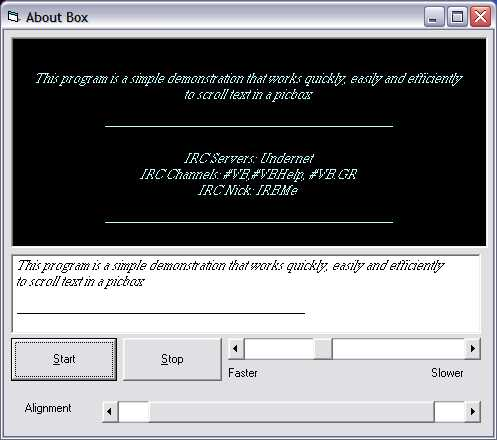



## Simple API Text Scroller \(Great for About Box\)

### Description

Little API that will show you how to make a nifty little scrolling text picturebox using the rect and scrollDC API's. Check it out, and if you like it, leave some feedback.
 
### More Info
 

             |
---                |---
**Submitted On**   |2002-10-22 17:58:02
**By**             |[IRBMe](https://github.com/Planet-Source-Code/PSCIndex/blob/master/ByAuthor/irbme.md)
**Level**          |Beginner
**User Rating**    |5.0 (50 globes from 10 users)
**Compatibility**  |VB 5\.0, VB 6\.0
**Category**       |[Windows API Call/ Explanation](https://github.com/Planet-Source-Code/PSCIndex/blob/master/ByCategory/windows-api-call-explanation__1-39.md)
**World**          |[Visual Basic](https://github.com/Planet-Source-Code/PSCIndex/blob/master/ByWorld/visual-basic.md)
**Archive File**   |[Simple\_API14856410222002\.zip](https://github.com/Planet-Source-Code/irbme-simple-api-text-scroller-great-for-about-box__1-40073/archive/master.zip)

